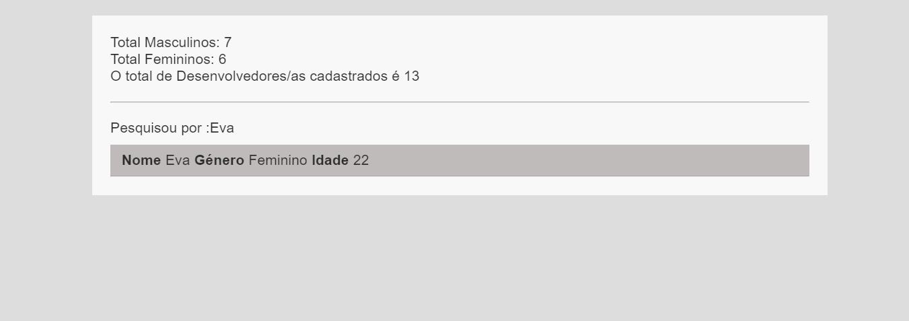
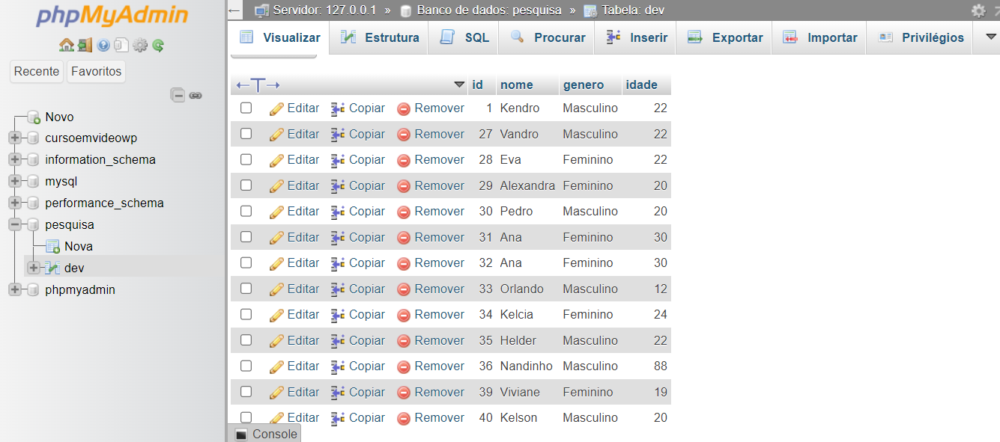

# BUSCADOR COM PHP E MYSQL
👨‍🏫FORMULARIO DE PESQUISA DE NOMES EM HTML, CSS, PHP E MYSQL.

 <br>
 <br>
 <br>

## DESCRIÇÃO:
Este aplicativo é uma simples ferramenta de pesquisa desenvolvida com HTML e PHP. O objetivo principal é permitir que os usuários pesquisem por informações sobre desenvolvedores (ou outro tipo de dados) e visualizem os resultados.

## FUNCIONALIDADES:
1. **Formulário de Pesquisa:**
   - Um formulário HTML permite ao usuário inserir uma consulta de pesquisa e enviar essa consulta para a página de resultados.

2. **Página de Resultados:**
   - A página de resultados (`pesquisa.php`) processa a consulta e exibe o número total de desenvolvedores divididos por gênero (masculino e feminino) e o total geral.
   - Exibe os resultados da pesquisa com detalhes sobre cada desenvolvedor (nome, gênero e idade).

3. **Consulta e Exibição de Resultados:**
   - A pesquisa é feita em uma base de dados, e os resultados são exibidos com detalhes relevantes.

## EXECUTANDO O PROJETO:
1. **Configuração do Banco de Dados:**
   - Antes de executar o site, é necessário importar o arquivo `DATABASE.sql`. 

2. **Configuração do PHP:**
   - Abra o arquivo `./CODIGO/bd/conexao.php` e ajuste as configurações do banco de dados:

     ```php
     $host = "localhost";
     $user = "seu_usuario";
     $pass = "sua_senha";
     $database = "pesquisa";
     ```

3. **Subindo o Servidor:**
   - Coloque os arquivos desse diretório em um servidor web compatível com PHP (por exemplo, XAMPP, WAMP, LAMP).

4. **Acessar o Formulário de Pesquisa:**
   - Acesse o formulário no navegador visitando [http://localhost/BUSCADOR%20COM%20PHP%20E%20MYSQL/CODIGO/index.php](http://localhost/BUSCADOR%20COM%20PHP%20E%20MYSQL/CODIGO/index.php)
   - Insira o nome ou termos de pesquisa no campo de texto e clique em "Pesquisar".

5. **Visualizar os Resultados:**
   - A página `pesquisa.php` será carregada, mostrando o total de desenvolvedores masculinos e femininos, além de exibir os resultados da pesquisa baseada no nome inserido.

6. **Verificar os Resultados:**
   - Os resultados da pesquisa serão exibidos com as informações de nome, gênero e idade dos desenvolvedores que correspondem à pesquisa. Se nenhuma informação for encontrada, será exibida uma mensagem informando isso.

## NÃO SABE?
- Entendemos que para manipular arquivos em `HTML`, `CSS` e outras linguagens relacionadas, é necessário possuir conhecimento nessas áreas. Para auxiliar nesse aprendizado, oferecemos cursos gratuitos disponíveis:
* [CURSO DE HTML E CSS](https://github.com/VILHALVA/CURSO-DE-HTML-E-CSS)
* [CURSO DE PHP](https://github.com/VILHALVA/CURSO-DE-PHP)
* [CURSO DE MYSQL](https://github.com/VILHALVA/CURSO-DE-MYSQL)
* [CURSO DE PHP COM MYSQL](https://github.com/VILHALVA/CURSO-DE-PHP-COM-MYSQL)
* [CONFIRA MAIS CURSOS](https://github.com/VILHALVA?tab=repositories&q=+topic:CURSO)

## CREDITOS:
- [PROJETO CRIADO PELO "pintofilipe20"](https://github.com/pintofilipe20/Buscador-de-Dados-Php)
- [PROJETO EDITADO PELO VILHALVA](https://github.com/VILHALVA)


